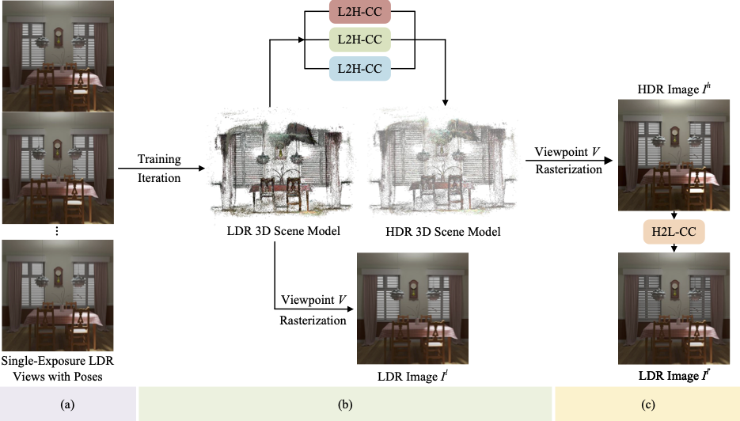

# Mono-HDR-3D: High Dynamic Range Novel View Synthesis with Single Exposure
### [Videos](https://drive.google.com/drive/folders/1k68pKgKYgYBi0urAPWROOLC8G2u8hxRX?usp=sharing) [Paper](https://arxiv.org/abs/2505.01212) | [Dataset](https://drive.google.com/drive/folders/1OTDLLH8ydKX1DcaNpbQ46LlP0dKx6E-I?usp=sharing)

## Abstract
High Dynamic Range Novel View Synthesis (HDR-NVS)
aims to establish a 3D scene HDR model from Low Dynamic Range (LDR) imagery. Typically, multiple-exposure LDR images are employed to capture a wider range of brightness levels in a scene, as a single LDR image cannot represent both the brightest and darkest regions simultaneously. While effective, this multiple-exposure HDR-NVS approach has significant limitations, including susceptibility to motion artifacts (e.g., ghosting and blurring), high capture and storage costs.
To overcome these challenges, we introduce, for the first time, the *single-exposure* HDR-NVS problem, where only single exposure LDR images are available during training. 
We further introduce a novel approach, Mono-HDR-3D, featuring two dedicated modules formulated by the LDR image formation principles, one for converting LDR colors to HDR counterparts and the other for transforming HDR images to LDR format so that unsupervised learning is enabled in a closed loop.
Designed as a meta-algorithm, our approach can be seamlessly integrated with existing NVS models. Extensive experiments show that Mono-HDR-3D significantly outperforms previous methods.

## Overview
Given single-exposure LDR images (with corresponding camera poses) as input, we first learn an LDR 3D scene model (e.g., NeRF or 3DGS). Then, we elevate this LDR model to an HDR counterpart via our camera-imaging–aware LDR-to-HDR Color Converter (L2H-CC). Additionally, we introduce a latent HDR-to-LDR Color Converter (H2L-CC) as a closed-loop component, enabling the optimization of HDR features even when only LDR training images are available, which ensures the framework to be robust in the absence of ground-truth HDR data.
<p align="center">

</p>

## Quick Start
### Setup
```
git clone https://github.com/prinasi/Mono-HDR-3D.git
cd Mono-HDR-3D

cd Mono-HDR-GS
conda create -n mono-hdr-gs python=3.9 -y
pip install -r requirements.txt

cd ../Mono-HDR-NeRF
conda create -n mono-hdr-nerf python=3.9 -y
pip install -r requirements.txt
```

### Download dataset
We use the an HDR dataset (multi-view and multi-exposure) that contains 8 synthetic scenes rendered with [Blender](https://www.blender.org/) and 4 real scenes captured by a digital camera. Images are collected at 35 different poses in the real dataset, with 5 different exposure time $\{t_1, t_2, t_3, t_4, t_5\}$ at each pose. You can download all the dataset in [here](https://drive.google.com/drive/folders/1OTDLLH8ydKX1DcaNpbQ46LlP0dKx6E-I?usp=sharing). 

## Train
For both Mono-HDR-3D and Mono-HDR-NeRF, we provide a bash script to train the model.
```bash
bash single_train.sh <scene_name> <gpu_id>
```
For example, to train Mono-HDR-GS on the flower scene with 0-th GPU, run:
```bash
cd Mono-HDR-GS
bash single_train.sh flower 0
```

Intermediate results and models are saved in ```output/mlp/<scene_name>```

## Cite 
```
@article{zhang2025highdynamicrangenovel,
      title={High Dynamic Range Novel View Synthesis with Single Exposure}, 
      author={Kaixuan Zhang and Hu Wang and Minxian Li and Mingwu Ren and Mao Ye and Xiatian Zhu},
      year={2025},
      eprint={2505.01212},
      archivePrefix={arXiv},
      primaryClass={cs.CV},
      url={https://arxiv.org/abs/2505.01212}, 
}
```

## Acknowledge
Our code is based on the famous pytorch reimplementation of [HDR-GS](https://github.com/caiyuanhao1998/HDR-GS) and [HDR-NeRF](https://github.com/xhuangcv/hdr-nerf/). We appreciate all the contributors.
